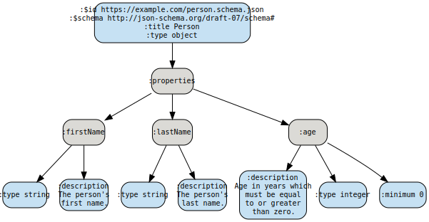

# clj-json-viz
A Clojure library for visualizing json that uses Graphviz as a backend.

This library is not deployed Clojars so instead can be installed from the latest git SHA using tools.deps.

## Usage

In project.clj

    [clj-json-viz "0.1.0"]
    
In your namespace

    (:require [clj-json-viz.core  :as viz])
    
    (def js (slurp "my-json-file.json"))
    
    (js->dot js)  ;; returns graphviz' dot language description.
    
or

    (:require [clj-json-viz.aws  :as aws])
    
    (def js (slurp "my-json-file.json"))
    
    (def path-to-graphviz "/usr/local/bin/dot")  ;;change to *your* path
    
    (js->svg js :path path-to-graphviz)  ;; returns svg.
    
## REST service

This library is deployed on AWS (London) and is up and running as a service that you could POST Json to. Here's an example of usage:

    curl -v -X POST \
     'https://nf45eg8r27.execute-api.eu-west-2.amazonaws.com/beta' \
     -H 'content-type: application/json' \
     -d '{
     "$id": "https://example.com/person.schema.json",
     "$schema": "http://json-schema.org/draft-07/schema#",
     "title": "Person",
     "type": "object",
     "properties": {
       "firstName": {
         "type": "string",
         "description": "The persons first name."
       },
       "lastName": {
         "type": "string",
         "description": "The persons last name."
       },
       "age": {
         "description": "Age in years which must be equal to or greater than zero.",
         "type": "integer",
         "minimum": 0
       }
     }
   }'
   
## License
 
This library is offered under the MIT license.
